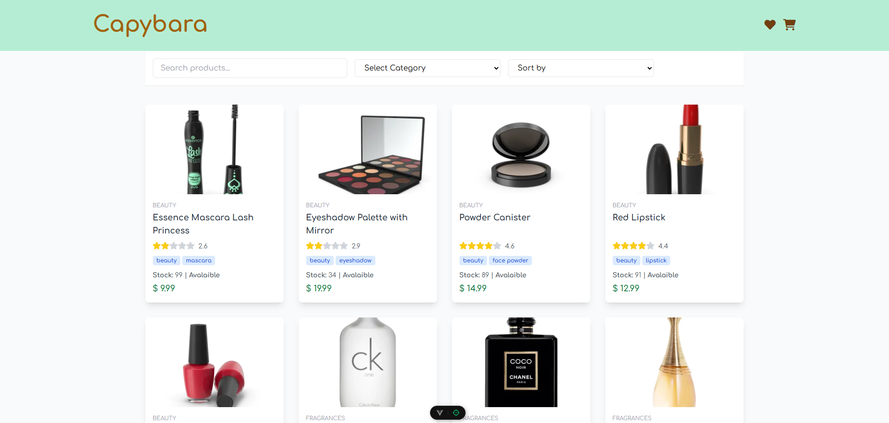
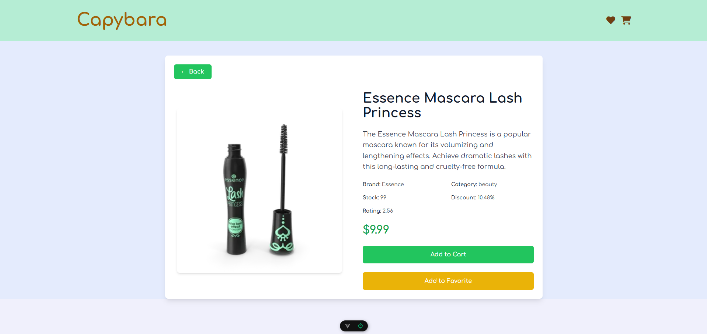
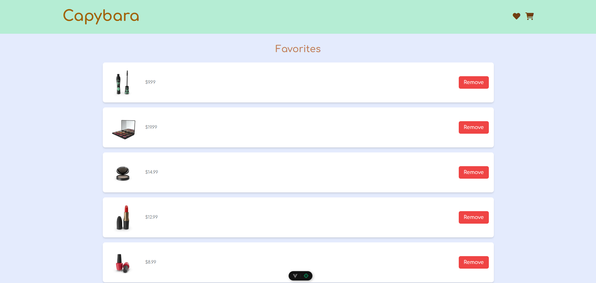
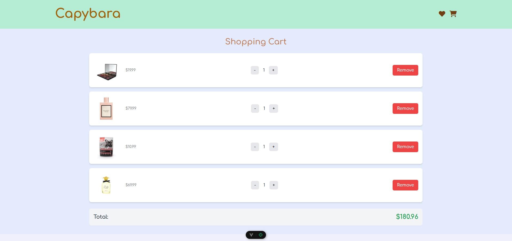

# 🛒 Capybara Store

Capybara é uma aplicação web construída com **Vue 3**, que permite aos usuários visualizar, favoritar e adicionar produtos ao carrinho de compras. Os dados são consumidos da API DummyJSON, e o estado do carrinho e favoritos é armazenado no localStorage.
Atividade avaliativa para o 3º termo na matéria de front-end lecionado pelo professor Valdir Júnior.

## 👥 Integrantes
- Estevão Alves dos Santos 1990000
- Vanessa Kaori Kurauchi 2002344

## ✨ Funcionalidades

- 🔍 Busca e filtro de produtos
- 📦 Visualização de detalhes do produto
- 🛒 Adicionar e remover do carrinho
- ❤️ Adicionar e remover dos favoritos
- 📊 Visualização da quantidade em estoque, preço e avaliações
- 💾 Armazenamento no `localStorage`

## 🧑‍💻 Tecnologias utilizadas

- [Vue.js 3](https://vuejs.org/)
- [Vite](https://vitejs.dev/)
- [Vue Router](https://router.vuejs.org/)
- [Axios](https://axios-http.com/)
- [Tailwind CSS](https://tailwindcss.com/)

## 🚀 Instalação e Execução

### 1. Clone o repositório

```bash
git clone https://github.com/seu-usuario/capybara-vue.git
cd capybara-vue
```
2. Instale as dependências
```bash
npm i
yarn
```
3. Inicie o servidor de desenvolvimento
```bash
npm run dev
yarn dev
```
Se a porta 5173 estiver desocupada, a aplicação estará disponível em http://localhost:5173.

## 🔗 API utilizada
https://dummyjson.com/products

## 📸 Captura de Tela





